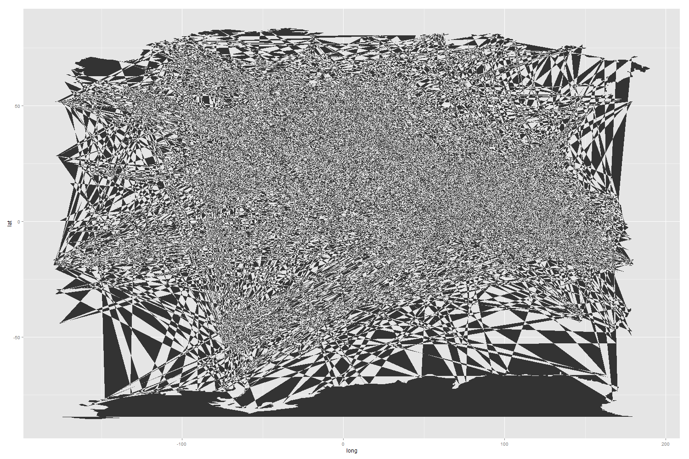

Final Project
==============================

| **Name**  | Cole Wrightson  |
|----------:|:-------------|
| **Email** | cwrightson@dons.usfca.edu |

## Discussion ################

Below is a detailing of my visualization on the geography of the NBA.
The shiny app used for this project has four tabs with interactive plots: 
"NBA Player Map",
"Basketball Hotbeds",
"NBA Geographies over Time",
"Talented Populations",

The following packages must be installed prior to running the app:

- `ggplot2`
- `shiny`
- `maps`

To run this code, please enter the following commands in R:

```
library(shiny)
shiny::runGitHub('msan622', 'cwrightson', subdir = "final-project")
```

## Data ##

The data for my visualization I procured myself by scraping the website basketball-reference.com.  
I used Python and the BeautifulSoup package to collect the biographies and yearly statistics of all 4217 and players known to have played in at least one game in the National Basketball Association (NBA), the American Basketball Association (ABA) or the Basketball Association of America (BAA) since the end of World War II. The raw (with BBR errors) .json file, `BBR_data_2014_04_15.json`, can be found in this repository as well. All of current NBA franchises have their foundational roots in one of these three leagues, which are considered the top professional leagues to have existed in North America since 1946.  

With a data set that has far too many dimensions, variables and cross-sections, I decided to focus on visualizations where basketball players in the NBA come from.  This portion of the data makes statistical measures somewhat trivial, but allows me to experiment visualizing data with maps and produce results that are immediately interpretable and relatable even to the non-basketball enthusiast. 

Additional population data from the 2010 US Census was need.
Geocoding was processed via a combination of the geopy package for Python to call the GeoNames API as well as a public MaxMind GeoLiteCity file and the Google Geocoding API. Also, basketball-reference.com is not without errors and some 200+ city locations were corrected by hand as municipalities change names or are annexed over time or simply misspelled. 

## Techniques ##

###NBA Player Map###


The most important visualization of the quartet is the map which plots the location of all 4217 players during various known points in their lifetime. For many of the players it is known in what city they were born, the city in which they attend high school, the college they went to if any, and the location of all of the NBA, ABA, and BAA teams they played for. For this graphic, individual municipalities were mapped as points using their latitude and longitude.  This points were plotted of the stock `{maps}` shape files for the world and for the United States.  The color of the point is encoded to the time period during which the player was in a location; 'Place of Birth', 'High School', 'College', 'NBA'.  The points were sized based on the number of players that were from the location represented by the point at a given time period.  Therefore, a given municipality may have as many as four points if all of the locations are plotted at once. 

The data density for this plot is fairly high as the entire plot is showing information.  On a map, even the locations that do not have points represent information as it lets us know that no player has come from that location.  The density of the data itself is also import because it conveys the relative density where NBA player were or are. 

The data-to-ink ratio is also high, as would be expected for a map.  The context of the map makes the context of the data clear to anybody.  A small legend is necessary to explain the use of color, but location and size are self-explanatory. 

For this map the lie factor is relatively minimal.  However I can identify four things that make consuming the data a little fuzzier. First, the number of player in a particular location is encoded by the area of a circle and humans can struggle at time to compare the relative areas of circles.  However, the meaning of the circle size is intuitive and other shapes would not be as familiar or show the population density as well. Secondly, there is fair bit of over plotting that occurs because of the dot size and the fact that many cities, i.e. suburbs are located close to one another. I opted to avoid jittering and to deal with over plotted, by carefully ordering the points and adjusting the alpha value so that the maximum number of points could be seen and density could be clearly and accurately assessed. The third area of inaccuracy comes from the fact that all 2-D map projects of the ellipsoidal Earth are in accurate.  It would appear that while the geographic shape file uses a standard map projection, ggplot is using the latitude and longitude coordinates provided and mapping them either un-projected or only approximately projected.  This results in some of the points being located away from their "true" position on the map and is most noticeable at the higher latitudes. The last minor data lie is this visualization is that the size of the dots is not consistent as the map is adjusted to include/exclude locations and years.  By default, ggplot scales the dot size according to the maximum dot size, so that when a new location is included with a larger population all of the dots are rescaled from the previous rendering of the plot.  This can make it difficult to compare, for example, the number of players currently in the number from San Francisco to the total number of players from San Francisco since 1947.

The trends in this data are pretty clear.  Most NBA players are American and more populous places tend to produce more people that make it to the NBA. Over time, the NBA has become more international as the vast majority of the players from outside of the US and Canada are from the most recent years. The distribution of players between their place of birth and high school is relatively uniform, but many players did not attend high school in their city of birth.  The location that players attend college is very different than the others. Regions such as Kansas and North Carolina have a disproportionately high concentration of players. Most notably, the distribution of dot sizes for colleges is very different as players seem to congregate at a couple dozen locations with a more uniform distribution than the birthplace and high school locations which have a more exponential distribution where lots of the cities have a player or two and a handful have dozens or hundreds of players.  This trend of fewer cities, but larger number of players continues as expected as the level of competition and quality of play increase to the professional level. Even at the professional level, there is a trend from smaller cities to larger cities supporting professional basketball as the demographics of America shift over time and the popularity of basketball increases. The cities with professional teams are also the cities with the largest populations for place of birth and high school. 

This visualization is all about density, comparison and their evolution of time. Because the focus is on comparison, I decided that two maps were a great improvement over one because each map could separately configured so that a specific comparison between seasons to decades or location could be made.  I believe that this is the greatest strength of this interactive visualization.

###Basketball Hotbeds###


The second visualization is effectively the same information as the map but in bar chart format so that the user can easily compare the sizes of the largest populations for various cross-sections of the data. Here the number of players that are from a particular location is represented by the length of the corresponding bar. The locations are no longer located spatially but ordered vertically from largest to smallest.  The data can again be subset by place of birth, high school, and college as well as which seasons since 1946 should count toward the tabulations. The biggest difference in information provided by the bar chart over the map is that the spatial information is now encoded by a geographic category that allows the user to select between city level, state level, country level or continental level. The color is simple but used very subtly to emphasis the difference between high and low values.

The data density is fairly low but this allows for very simple comparisons and easy comprehension.
The data-to-ink ratio is pretty good and all of the superfluous text and decorations have been removed.
The lie factor of a bar chart is very close to one. Really the only thing that could be misleading about the chart is that not all of the data is shown because showing over one thousand unique municipalities in a single bar chart would be silly. I have limited all of the charts to plot at most ten locations. It is possible that the tenth most populous locations and the eleventh most populous location have the same number of NBA players. It this case it is unclear which location should be displayed or which location is indeed the tenth largest for that cross-section.  

The bar chart showed me that the US is more dominant demographically in the NBA than I realized.  Many of the stars in the league are from other countries, but a lot of the mediocre, by elite basketball standards, players from other countries do not try to come to the US.  It would be fascinating to expand the data set to include leagues in other countries, or to normalize the player population somehow by the quality of each player.  AS is, this bar chart excels at states the basic summary statistics of how many people are from each of the countries or regions and how that is divided between high school, college, etc.  I was also surprised by the universities that are topping the list of foreign-born players that made it to the NBA.  Long Island University, who knew?

###NBA Geographies over Time###


This stacked area visual adds another dimension to the bar plots by encoding time on the horizontal axis rather than having time be a filter for the bar that are plotted. This is another was to look at the underlying data in the map by seeing how new players in the NBA are distributed based on their basketball roots.  It is linked to the bar chart so that the user-defined settings are the same for the two of them.  This should allow for easy comparison between the two viewpoints of the same data. 

The data density of the plot is fairly high as the area if the plot itself is used to encode information.
The data-to-ink ratio is good as additional annotations are unnecessary outside of a legend that relates color to the group that is being plotted.
The lie factor here is minimal, especially since it is linked to the other plot. The data density is better than a simple multiline plot although it is relatively hard to interpret. The data-to-ink ratio

From this plot I learned that the rookie class each year is very inconsistent.  While there are clear trends when a single season or more of players is investigated, when looking only at the new players each year is not too useful.  The data is simply too noisy. This visualization also does a good job of showing odd trends in the data collection.  The large spikes correspond to either a large influx of new player into the league, via merger or expansion, or because the records were better kept to historians are now better aware of the players that actually took part in the games.  


But on a more serious note, the best thing about this visualizations is that sometimes you get things that are just cool even if the meaning is somewhat obsure...


###Talented Populations###


The most analytical of the visuals is found in the last tab. This plot compares the populations of cities and states in the US to the population of NBA players that they have produced. I have plotted the 2010 Census data for all fifty states and Washington DC as well as the top 50 most populous American cities on the x-axis against their corresponding NBA population on the y-axis. Each point on the graph represents either a state or a city.  The size of the points are uniform as the plot shows only two dimensions however the color is important as it corresponds to the ratio of NBA players to general population for the plotted state/city. This ratio effectively shows to what degree a location is than average at producing NBA-level talent. I have also plotted a line that shows where the points would fall should the NBA population be exactly correlated with general population.

While the information is factual and the data is not skewed or rescaled this plot is misleading in that the x-axis shows data only from 2010, while the y-axis can show data from any number of years.  This undoubtedly distorts the data and affects which conclusions can be drawn.  Ideally, the data for the general population would adjust as the y-axis time periods are adjusted. For this reason, I would say that this plot has the worst lie factor of my four plots. The data density of the plot is pretty low, although the white space between the points and the line is important.  It turns out that the angle from the origin to each point represents the ratio of NBA players to the general population and that the steeper the angle the more NBA-talent per person a region has produced.  The data-to-ink ratio is lowered somewhat by the region labels and the grid lines, but the most important thing in this plot is not the density, although that is useful, but which side of the line a particular region falls on and whether there is a trend between regions that are above versus below the line.  In theory regions above the line should correspond to increased point density in the map on the first tab of the app. 

From this scatter plot, I learned that southern states and more urban cities produce NBA talent at a greater rate. In earlier years, the Midwest was better at producing NBA talent than today, save for Chicago. I am pleased with this plots ability to show how the normalized populations of NBA players compare between states and large cities.  I am disappointed that the color encoding is not very useful because the scale from high to low is thrown off by outliers with very low NBA-talent to general population ratios. Perhaps this information could be better shown on a map where the points are colored by the ratio and then sized by the absolute number of players produced.


## Interactivity ##

The interactivity for the four visualizations is somewhat standardized to limit the complexity and to link the multiple plots between one another. Because much of the data is based around location and some form of time the interactivity deals with the same topics.  

On the map, the user can select whether they want to visualize the whole world or focus on just the United States where most of the NBA population is based. They control time by selecting the periods of time in a player's basketball life that they want to visualize as well as the NBA seasons which they want to factor into the visualizations and calculations.  In fact this last slider that controls the years to visualize is included in every one of my visuals. For the map the time periods are important to visualize because they show the geographic influence on the basketball developmental pipeline from the hometown playground to the large stadium in America's largest and most glamorous cities. Showing the different seasons is useful because it allows the user to see trends develop over the last 60+ years.  To aid with this I have created two maps each with a UI so that two static maps can be created for direct comparison.

The second and third plots have the same interface panel. Here the user is mostly concerned with which points in time of a basketball player's lifecycle they want to investigate and what geographic category they are most interested in.  These options give the user control over which cross section of the player location data they are most interested in investigating.  Linking the interface across multiple plots makes the comparison of the different points of view more seamless.

The last plot has the simplest interactivity panel because it is the smallest subset of the data. Here the user can only investigate data on American-born players.  However the selected inputs control the lens by which the various cities and states are compared to one another.  Ideally this plot would allow the user to zoom in on the over-plotted points.  However, when I tried to implement this, an important feature of the plot was lost, the line of perfect correlation between NBA population and general population.  This line is plotted through geom_abline(), but when the axis are adjusted the line also moves and no longer represents the slope and intercept that it was programmed to affix to.  The order in which the plot is created was not able to fix this problem so I decided that zooming could be done without.  The important ideas from this plot are apparent nonetheless. 


## Prototype Feedback ##

The prototype feedback was useful, although I wish it had come later in the process.  At that point I only had one visual.  I had a map that was very similar to the one that I presented a couple of days later in class. I did make the changes that were suggested to me, such as color palette changes as well and appropriate interactions. Honestly, there was not too much substantial feedback and there was nothing that I disagreed with. There was some worry that it would be difficult to implement the migration patterns that I envisioned and they were correct. For the most part their feedback confirmed what I had already assumed were the issues or going to be issues, but it is always good to make sure that others are in consensus.


## Challenges ##

This project was challenging in that I had ambitious plans for a single interactive map that could do many things over a complex data set. From the beginning I was focused on a data set that was fun and meaningful to me and therefore spent more time collecting the data, processing the data and then figuring out how to format the data to meet ggplot's needs. For this reason I feel that a lot of the visuals and interactivity suffered because just having something to plot took much longer than if I had worked with a pretty data set from the UCI Machine Learning repository. 

If I were focused on only the visualization side of the project, then I would have made the data simple and preformatted so that I could work on maximizing the value that one could get out of visually interacting with the data.  In hindsight, that would have been the wiser decision as a more polished and presentable interactive visualization would have been produced with less of a time investment.  However, I still have learned a lot about the process of going from an idea about how to visualize data and the underlying information embedded in a theoretical data set to actually creating that visualization, even if the beginning and middle part of that process were much more time consuming that originally imagined. 

More specific challenges I have encountered, but still yet to conquer involve are mostly data structuring issues of how best create a data frame that ggplot can turn into lines and points.  For example, I spent a considerable about of time trying to show the paths that players took from their place of birth to high school to college and to the NBA and then between cities in the NBA.  Eventually, I was able to connect the dots on my map and show the migrations of the professional basketball players, but the data was too messy and the added information was too low for the amount of complexity that it was going to take, so I eventually scrapped the project. But here is an idea...


Or not an idea...




If I were to continue with this visualization, I would be sure to implement the migrations of the players.  I would also allow for the selection of cities and players for the user to highlight/brush so that they can see where their favorite player is from or what other places feed players to a user's favorite team. The highlighting could be expanded to correspond to the other plots, so, for instance, if San Francisco were highlighted then the bar plot and the scatter plot and the time series plot would all be sure to include San Francisco although it may not be in the top ten that are automatically shown. 

Another important improvement would for the time series multiline plot, which I believe is the weakest graph of the four.  It would be much more useful and interpretable if each y-value were for all players that were in the NBA during a given year rather than just those that were rookies that season.  It is harder to see trends when the rookie classes each year are noisier than the larger sample size of some 300+ players each year. 

Another challenge that I have mentioned previously was in regard to maintaining consistent dot size limits or bar size limits so that when the data is filtered that the limits to not scale to the new maximum value.  For a bar plot or a scatter plot this is simple as ggplot allows for the axis limits to be hard coded to a value.  However when a size or an alpha value is desired to not be rescaled, I was not able to keep ggplot from rescaling the dot size allow I was scaling the maximum size in the other direction so that the new maximum would be the same size as before. 

Another challenge is getting the initial map to load quickly.  It takes a long time to load because of the way that the size of the dots is calculated.  Another problem is that it must recalculate the dot size every time the years are re-filtered by the user. This would not be a problem if the NBA teams were not plotted as well but because the teams that a single player plays for cannot be represented in a single column, the table() function cannot be used and a nested for loops are necessary to calculate a total that spans multiple lists. 
It I had more time I would create a hierarchical look up table with the values for all of the various potential year filterings pre-stored so that the calculation would be instant and the map would render quickly.

