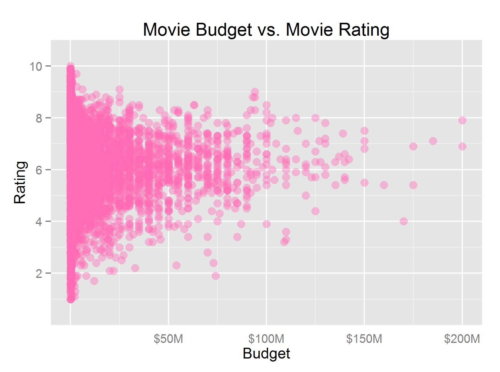

Homework 1: Basic Charts
==============================

| **Name**  | Cole Wrightson  |
|----------:|:-------------|
| **Email** | cwrightson@dons.usfca.edu |

## Instructions ##

The working directory for this code is set to the local directory of the files on my personal computer.   
The local path must be changed for this code to function properly.  
The packages ggplot2 and reshape2 must be installed as well.

## Discussion ##

Plot 1: Scatter plot of Movie Budget vs. Movie Rating

For the scatter plot, I was focused on conciseness and legibility. 
To achieve this, I went with a high contrast color against the gray back ground and give the points an alpha value to help should the varying density.
I cleaned up the presentation by removing minor axis lines, and formatting the x-axis tick labels.
Although it is hard to see all of the points, the general shape of the data is easier to understand with a linear scale for budget rather than a log-scale.

Plot 2: Bar plot of Movie Genre Frequencies

A bar chart is used for comparing a single value across multiple categories and for this reason I made such to have a distinct color palette.
To make the bars pop a little against the background, I added a subtle white border around each bar.
To make the chart more clean and legible, I removed excessive axis lines and tick marks and left the axis labels blank because they are self-explanatory.

Plot 3: Plots of Movie Budget vs. Movie Rating by Genre

The multiples plot is effectively a combination of the previous two charts so the features should be consistent across the all three.
For this reason, the alpha value was retained and the colors for the bar chart are maintained as well as the formatting of the axis labels and tick marks.
I choose to display the various plots in a 3x3 square for compactness, and I kept the ordering the same as the bar chart.
As with the previous plots, I also adjusted the expand option for the x and y axis as well as the total range displayed for each axis.
It is import to include the zero-intercept but not have excessive ranges or tick marks.

Plot 4: Time series Plot of European Stock Indexes

For the time series, I wanted to use the same vibrant color palette as before for consistency but only include the first four colors, of course.
I was careful to order the colors so that they would best contrast the adjacent lines.
This was the only plot where a legend was appropriate as it helps differentiate the series and inform the purpose of the plot.
The graph has been made more presentable by removing minor axis gridlines and specially formatting the axis tick labels.

