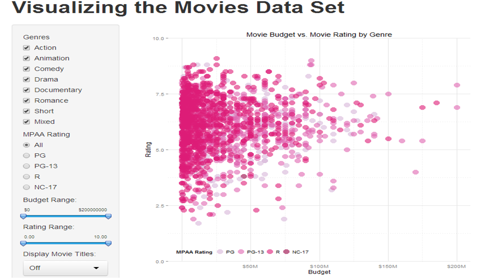
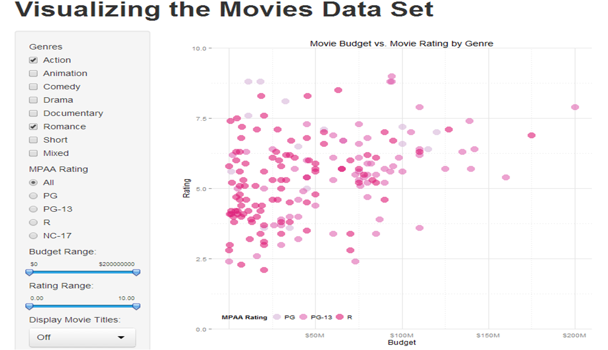
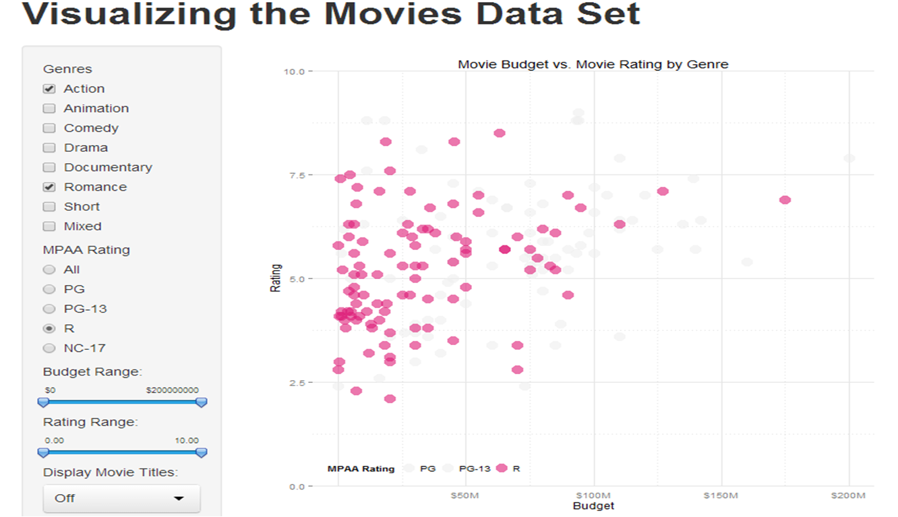
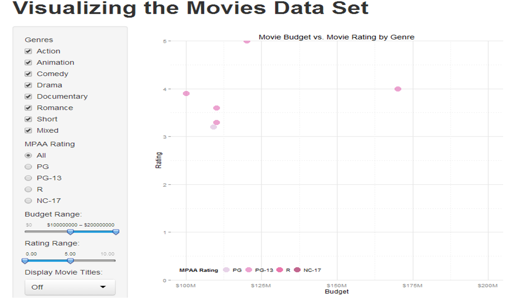
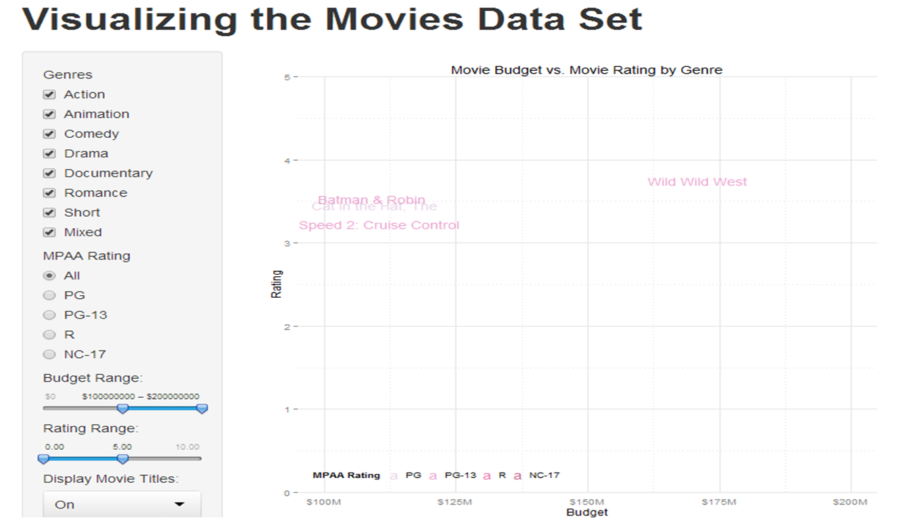
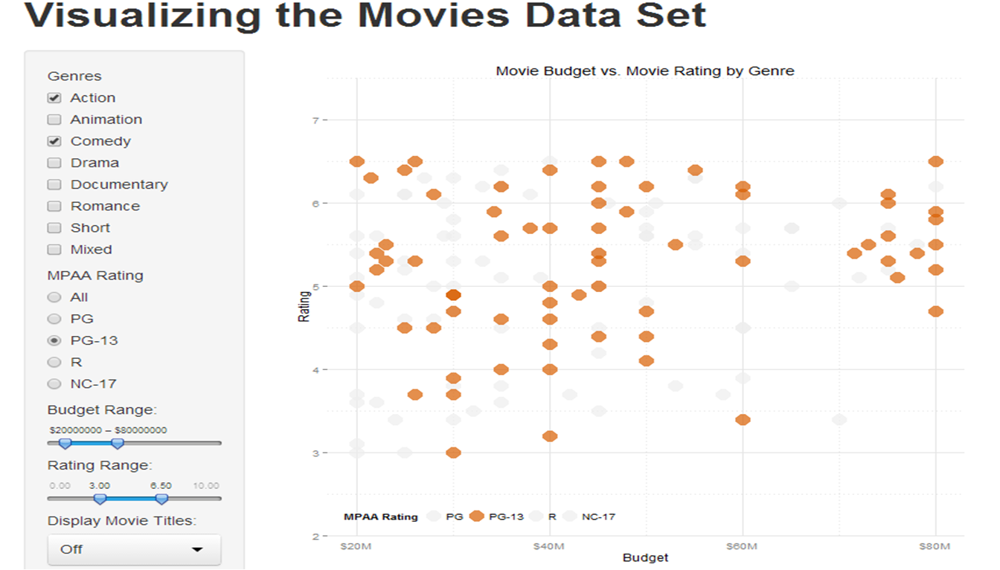

Homework 2: Interactivity
==============================

| **Name**  | Cole Wrightson |
|----------:|:-------------|
| **Email** | cwrightson@dons.usfca.edu |

## Instructions ##

The following packages must be installed prior to running this code:

- `ggplot2`
- `shiny`

To run this code, please enter the following commands in R:

```
library(shiny)
shiny::runGitHub('msan622', 'cwrightson', subdir = "homework2")
```

This will start the `shiny` app. See below for details on how to interact with the visualization.

## Discussion ##

The opening page of my shiny app:



The goal of the initial graph for my shiny app was too replicate my first plot from homework one but with the addition of a slight contrast in the point colors to represent the distinct MPAA ratings.  
The dot size and alpha initial values are set to middle values that I feel best show the overall density of the movies budget and viewer rating relationship. The order of the sidebar options was determined by how much each option changes the information that is being presented in the graphic. 
The genres selection boxes are first because data points are removed from the plot depending on which genres are selected.
The color scheme, dot size and the opacity of the points are last because they do not change the underlying information being displayed in the plot.
I also needed to make sure that the most interactive options were on the same level as the plot itself so that the user is not scrolling between the options and the plot that the option has just changed.


Selecting a Genre:



Using the check box selection tool on the side bar, the user can select which genres’ data points to plot. 
This allows the user to remove movies whose genre they are not currently interested in including in their analysis.


Selecting an MPAA Rating:



From the selected movie genres, specific MPAA rated movies can be selected to highlight their location against the rest of the selected population.  To make this feature more effective, the highlighted MPAA rating data points are plotted last so that the grayed-out points are behind the points of interest.  Combined with the genres selection feature, the user can focus on specific subsets of movies and their relationship between budget and viewer rating.


Panning around the Graph:



One of the important extra features that I put in this interactive visualization was the ability to subset the data shown in the plot or pan to particular locations of interest. This was accomplished by creating interval slider bars that allow the user to define the x-axis and y-axis limits of the plot.
The app user can then use the same interactive visualization tools as before, but with smaller subsets of the data, and create narratives such as the image I have above.
This plot looks at high budget movies with very lower viewer rating.  Fortunately for movie producers, very few of the movies in the data set meet these requirements.

In my previous homework, I removed the $0 label for the budget axis because the intercept is obvious and the label tells the viewer what they already know.
However, the first label for the lower bound of the x-axis is necessary when the user can adjust the range of the budget that is displayed in plot.
I wrote a function that recognizes these facts and knows when to display the lower bound of the budget axis.  

I also took care to format the input sliders for adjusting the axis arranges.  
I set the available step sizes to natural intervals and made sure to format the numeric values with decimal places and dollar signs were appropriate.

Visualizing Movie Titles:



While playing with the data visualization, I always wanted to know which movies were actually being represented by the data points.
A table that corresponded with the data could be used for this purpose, but relating a specific point to a row in the table takes too much of the viewer’s time.
To be able to communicate which movie corresponds to each point, I added the option to change the point to the text of the movie title.

This is very useful, for example, in knowing which movies meet the high budget/low rating criteria being shown in the graphic.
However, there are several problems with using text as the data point representation in this particular case.  
First, it is hard to read thousands of movies titles plotted on top of one another.  
For this reason it is not the default setting of my app, but one that the user can go to when a specific subset of the data or an outlier of interest needs to have the data points identified by name.
To deal with data points that have very similar x,y coordinates, I jittered the points.  I set the amount of jitter in the x and y direction so that it is unlikely that they remain on top of one another and the jitter amount is scaled with the magnitude of the data point values. Jittering is not optimal, but at least the text can be read.  
The final, and most serious problem with displaying the text is that the text is centered of the data point x,y location. Points close to the edge of the plot will have a portion of their label cut off by the x-axis range of the graph.  This would be the first thing I would fix about my current shiny app implementation.


Changing the Plot's Appearance:



As requested by the homework requirements, the user can adjust the size of the dots, their opacity and the color palette used to distinguish the MPAA ratings.  The more technical aspects of these features are ensuring that the highlighted points were plotted on top of the grayed-out points and maintaining the color for each genre consistent each time the data set was re-subset.
