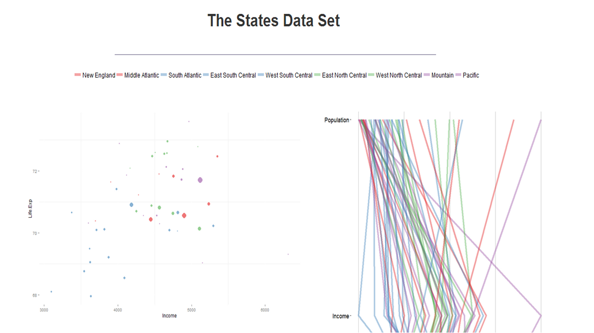
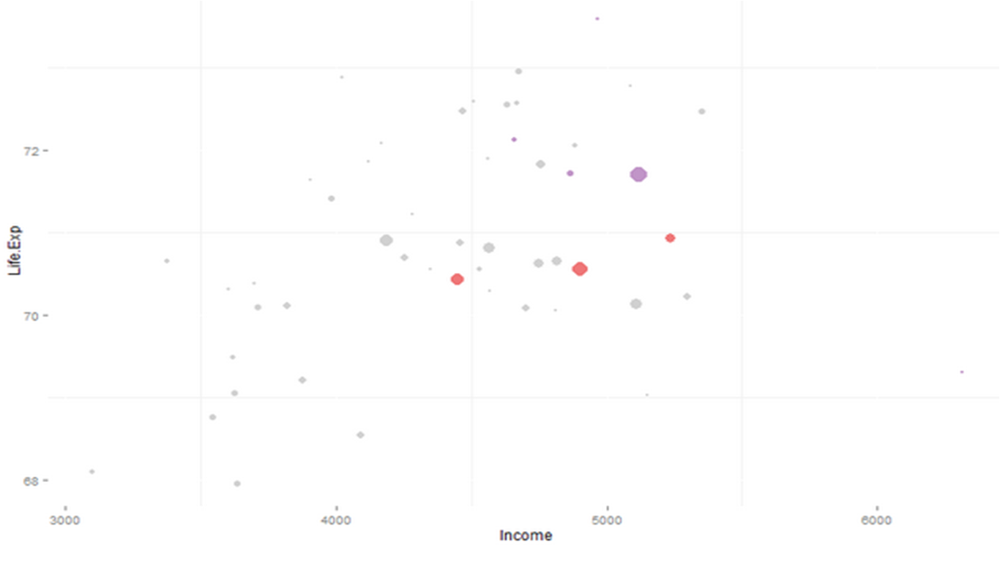
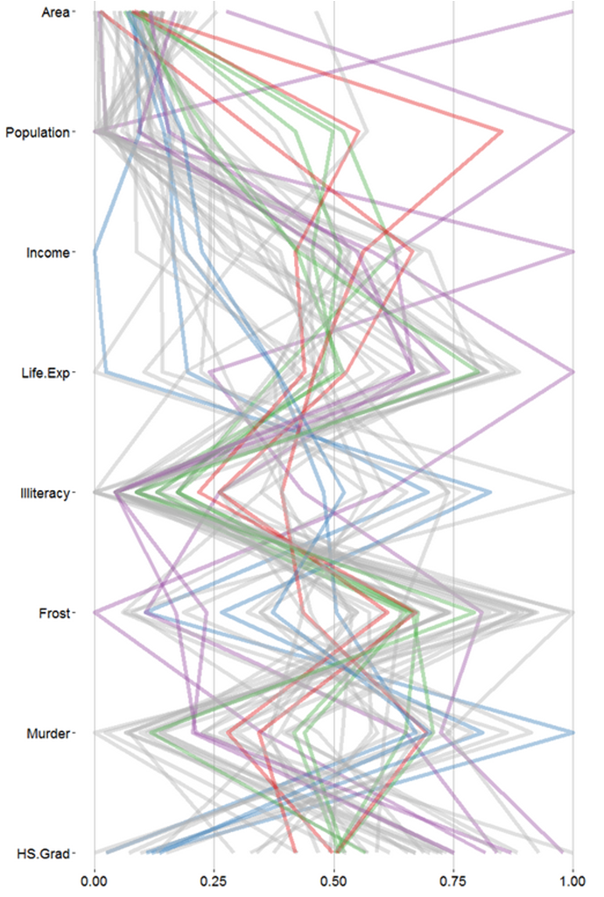
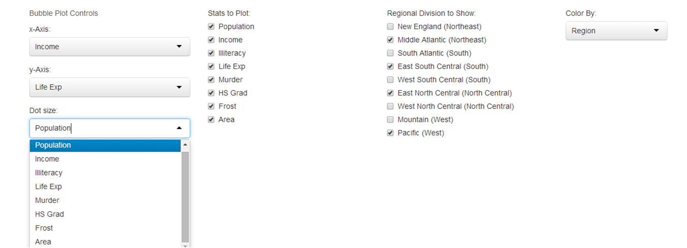

Homework 3: Multivariate
==============================

| **Name**  | Cole Wrightson  |
|----------:|:-------------|
| **Email** | cwrightson@dons.usfca.edu |

## Instructions ##

The following packages must be installed prior to running this code:

- `ggplot2`
- `shiny`
- `GGally`
- `reshape`
- `scales`
- `plyr`

To run this code, please enter the following commands in R:

```
library(shiny)
shiny::runGitHub('msan622', 'cwrightson', subdir = "homework3")
```

This will start the `shiny` app. See below for details on how to interact with the visualization.

## Discussion ##

### General Discussion ###



### Technique 1: Bubble Plot ###



Why did you chose this technique?
Which columns did you chose to include and why?
How you are encoding the data (e.g. which column do you use to determine color)?
What customization did you try and why?
What conclusions does your technique helps you make about the underlying dataset?

### Technique 2: Scatterplot Matrix ###


Why did you chose this technique?
Which columns did you chose to include and why?
How you are encoding the data (e.g. which column do you use to determine color)?
What customization did you try and why?
What conclusions does your technique helps you make about the underlying dataset?

### Technique 3: Parallel Coordinates Plot ###



Why did you chose this technique?
Which columns did you chose to include and why?
How you are encoding the data (e.g. which column do you use to determine color)?
What customization did you try and why?
What conclusions does your technique helps you make about the underlying dataset?

### Interactivity ###



How do you interact with your visualizations?
What approaches (overview + detail, focus + context, etc.) did you implement and why?
