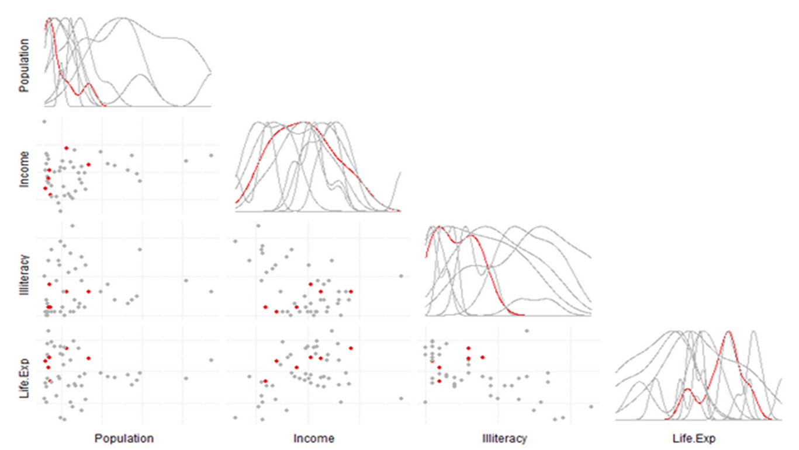

Homework 3: Multivariate
==============================

| **Name**  | Cole Wrightson  |
|----------:|:-------------|
| **Email** | cwrightson@dons.usfca.edu |

## Instructions ##

The following packages must be installed prior to running this code:

- `ggplot2`
- `shiny`
- `GGally`
- `reshape`
- `scales`
- `plyr`

To run this code, please enter the following commands in R:

```
library(shiny)
shiny::runGitHub('msan622', 'cwrightson', subdir = "homework3")
```

This will start the `shiny` app. See below for details on how to interact with the visualization.

## Discussion ##

### General Discussion ###

Below is the opening view of my visualization:


My goals for this visualization were to implement three visualization techniques on the same data set that worked together to tell a larger story.
For this reason, I wanted to keep things very simple but with high interconnectivity between the plots. 
I decided to plot all of the graphics at once so that relationships between the plots can be made instantly.
I also tried to make the options panel and legends as global as possible. 
The graphs have a single title, rather a than individual plot titles.
The legend is singular and applies to all three plots at all times as the colors and highlighted subsets are always linked between all plots.
The parallel coordinates plot and the scatter plot matrix are forced to always to display the same data set variables.
Unfortunately, laptop screens are not large enough to have large individual plots visible without scrolling, but I oriented the parallel coordinates plot vertically so that the user would know to scroll down the page because the plot is cut off at the bottom.


### Technique 1: Bubble Plot ###


I choose the bubble plot over the heat map because it was more applicable to this data set. 
Interactive heat maps are more effective when sort order is important or there is categorical data, and I feel that bubble plots are better at visualizing multivariate numerical features where the dot size and color can both play roles.
I did not explicitly choose a number of columns, as bubble plots can only show 2-4 dimensions.  
However, I did allow the user to choose which of the eight numerical columns they want to plot for any of the three axes.
I also allow for the coloring of the points to be by region or by division.
My implementation of the bubble plot can show three dimensions at once, plus a color the represents the categorical groupings of the data points.
One dimension is the x-axis, another is the y-axis and the third is the dot size. 
For customization, I choose a color palette from colorbrewer.org that was vivid and appropriate for categorical data.
The transparency is pretty minimal because the points infrequently overlap and the bigger points are plotted behind the smaller plots anyways.
The bubble plot allows for the same conclusions about the data set that could be made from a regular scatter plot.  
In addition to this, the extra dimensions afforded by the color and dot size allow for multi-way correlations between more than two variables to be seen at once.
It is especially useful to see how different regions tend to differ from one another by looking at how the colors group together.


### Technique 2: Scatterplot Matrix ###



I chose the scatter plot matrix over small multiples because of the way the matrix shows all of the inter-column relationships at the same time.
I also think that GGally's ability to plot the distribution of a variable is useful and adds to the plot.
The layout of the plot also adds to the ease of interpretation and insights that can come from the visualization.
I did not explicitly choose a number of columns as I allow the user to make that choice.
My shiny app allows for the user to decide which variables to include in the plot.
However, I did intentionally set the initial values to 3 columns of data.  
My decision had two reasons: First I wanted the features plotted to be the same as the above bubble plot so that there would be a clear relationship between all of the visualizations.
And second, the scatter plot matrix is larger and faster for the app to visualize when there are fewer variables to plot.
This makes a slightly better user experience and a better first impression than lots of tiny little plots that take a long time to load.
The encoding of the data is the same in the scatter plots are all of the visuals in the app; color is either the region or division of the state being plotted.
These colors and which encoding is shown are always consistent across all three techniques for easy translation from one plot to another.
As with all of the other visuals, the background was removed to make the boundaries between the visuals fade away.
I wanted to create a single visual that has three components that work together.
The scatter plot matrix allows for very quick observation of the positive/negative/neutral correlations between variables.
The addition of color by region or division allows the user to potentially see geographic tendencies as well.
I particularly like the group distributions that can be seen an compared to one another when brushing is used to emphasize only the regions of interest to the user.


### Technique 3: Parallel Coordinates Plot ###


My parallel coordinates plot is forced to have the same number of columns visualized as the scatter plot matrix.  
The user controls which and how many variables to plot.
Just as with the scatter plot matrix, the app is initialized with the same three variables as the bubble plot for the reasons mentioned previously.
The plot is oriented vertically so that all of the plots can be viewed together and so that the user knows right away that there is more to see and to scroll down the page when they see the initial view.
That would not be the case if the scatter plot and the bubble plot were located next to one another above the parallel coordinates plot.
The customizations and coloring of the data are the same as the other two plots for continuity.
I chose to scale the data so that each variable value would be between zero and one and the general relationship between columns could be seen.
It would be more difficult to see states that moved together along the plot is the columns were not normalized.
The biggest benefit from the parallel coordinates plot is the ability to see clusters of states that behave similarly. 
Using brushing can allow for the analysis of inter-region clusters or lack thereof should the user choose to investigate.


### Interactivity ###


As mentioned previously, the overall goal was a cohesive visual that allowed the plots to speak together.
I wanted the visuals and features to be minimal and intuitive, yet provide flexibility for the user to investigate the data as they see fit.
That is why all variables are available and all of the data is always present. 
Minimal text and keeping things simple and on the same page make the parts feel simple and more cooperative.
I required the interactivity to be consistent across all of the visuals so that interpretation would be simple and the user would never have to translate or ensure that they checked two bottoms together.

The interactivity of my shiny app has three basic components.
1.  A series of drop-down selection boxes that controls the variables to plot in the bubble plot.
The user can select any of the eight numerical columns to plot for any of the axes.
2.  The user can control which variables to plot using selection boxes in both the scatter plot matrix and the parallel coordinates plot.
They can choose any number of points to plot and if none are selected then all of them will be plotted.
This is effectively the same concept of giving the user control of what to plot as with the selection drop-down boxes in the bubble plot.
3.  The user can change what data they want to focus on in the visualization, either by coloring the data by region or group or by selecting which region to highlight or not.
These interactivity features are global to the visual so that all of the plots are always working together to help the user understand the data set.
The color and highlights in one plot always correspond to the same color and highlights in the other two plots.
In my previous assignment, I had added the ability to pan and zoom about the data set.  With the size of the data being only 50 observations, I do not think that panning or zooming is particularly helpful. 
I feel that brushing was the best way to highlight states as defined by the user and allows for subsetting and filtering when the user can decide which points to highlight and which points to de-emphasize.
