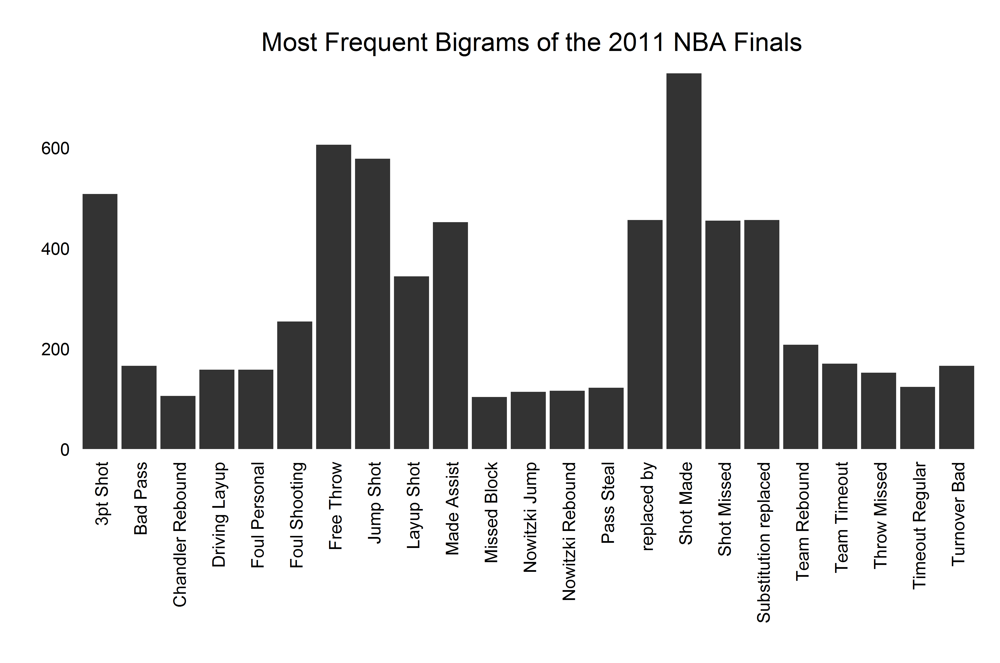
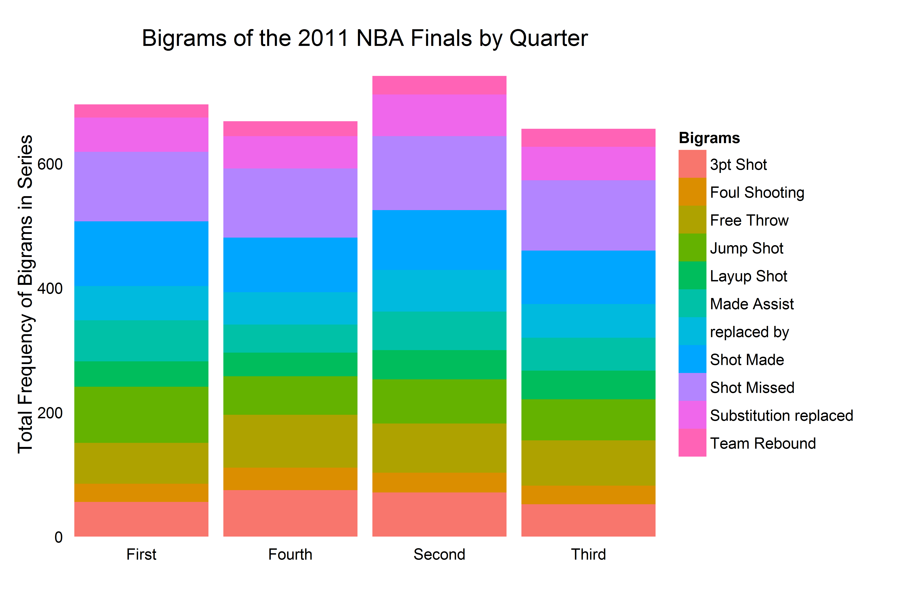
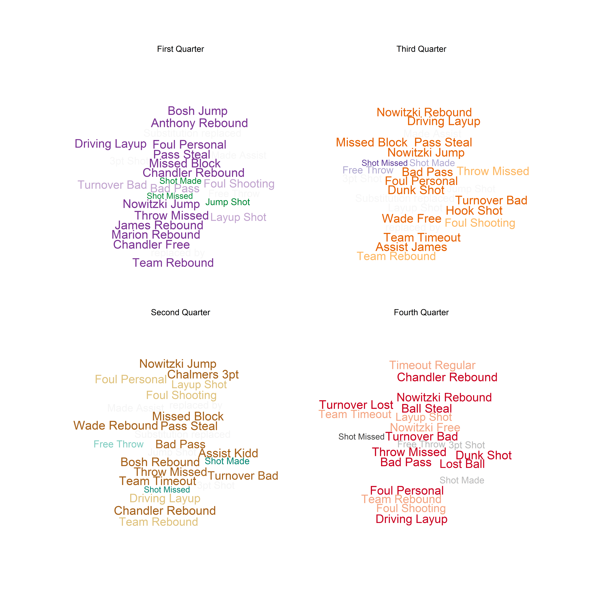

Homework 4: Text Visualization
==============================

| **Name**  | Cole Wrightson|
|----------:|:-------------|
| **Email** | cwrightson@dons.usfca.edu |

## Instructions ##

The following visualizations can be created using the code found in this repository.  

The data set came from http://basketballvalue.com/downloads.php  

`2011NBA_Finals_play_by_play.py` holds the Python code for turning the raw data into the text data used in visualization.  
Note that this is an IPython notebook file and requires that IPython be installed on your machine.

`visualize_2011_Finals_play_by_play_data.R` holds the R code for creating the visualizations

The following packages must be installed prior to running this code:

- `wordcloud`
- `ggplot2`
- `reshape`
- `tm`

## Discussion ##
  
For this assignment I choose to use basketball play-by-play records as my source of text data.
The data in sports is very rich and publically available.  
Basketball play-by-play data is something that adds another dimension, time, to traditional basketball statistics which makes it potentially more interesting that 'static' data.
More specifically, I have used the official textual records of discrete events that occurred during the 2011 NBA Finals, an event that was meaningful to me personally.
NBA play-by-play data is a time series of statistically significant events that occurs during an NBA game, such as made shoots, missed shoots, rebounds, etc.
The data locates in time these events as well as which person on the court performs them.
The vocabulary of this text is somewhat limited but, this makes it very feasible to do n-gram studies on the word sequences in each recorded event.
My visualizations are the beginnings of a look into which people, actions, and adjectives frequently occur together in an NBA basketball game.
The variables and data points in this data set are words;  words that correspond to people and actions that can be measured with other data sets, but looking at basketball through words can be interesting and enlightening none the less.  
  
The raw data set I downloaded from http://basketballvalue.com/downloads.php included some information that was not relevant to this particular assignment.
I removed unnecessary columns and performed some text cleaning in Python on my own.  
The `tm` package in R, is very specific in its utility and, after experimenting with it, I found that my own simple functions were better suited to calculating n-grams, frequencies of n-grams, and co-occurrence matrices.
I looked at n-grams for n = 1,2,3,4 and decided that bigrams were the most appropriate text feature for making insights into the data with word clouds and ggplot2.

The first step in analyzing the bigrams was to find which ones were the most frequent:

This plot shows the most frequent bigrams and their total frequency of occurrence during the six games played in the 2011 NBA Finals.
The bigrams are sorted alphabetically which makes them easy to read and searching for a particular phrase very quick.  
It is harder to compare the counts of the frequencies with this sort order, but given the wide range of values, most of the count totals are easy to distinguish from one another.  
It went with a simple aesthetic and removed all of the color, gridlines, padding and ticks from the plot.  
I was sure to orient the bigrams themselves vertically to avoid overlapping text, and I adjusted the text to align below each bar.
The x and y labels are not necessary to understand the graphic and therefore not plotted.  

The lie factor of this plot is 1.0.  There is no misrepresentation of the data.  
The bars start at the zero intercept and there is no use of a third dimension, shadowing, or anything to draw to viewer's attention to a particular feature.
I believe that the data-ink ratio for this plot is also good because excessive annotations and markers have been removed. 
Perhaps the total ink could be reduced a little bit, but the heavy and dark bars focus the attention of the data and not elsewhere in the plot.
The data density however is somewhat low for this plot, but that is not uncommon for a bar plot, especially one that is trying to give a very high-level over view of the text data.  
  

The next step in the visualization process is to take advantage of the temporal nature of this text data and break the bigrams into groups based on when they occurred during the basketball games.
To keep the visualizations simple and the sample size high, the games were divided into quarters, which are the natural breaks in NBA basketball games.
Here is a plot of the most frequent bigrams by quarter:  

This plot shows the most frequent bigrams in the data set and how frequently they were observed in the each of the four quarters of all six games.
This plot has an added dimension over the previous plot and uses color to distinguish between the various bigrams.
Again the plot is reduced to only the essential elements by removing the grids and labels that are not needed.  
This plot has a few problems that make it slightly harder to interpret.  
The ordering of the labels in the legend should match the order of the corresponding colors in the stacked bar plot.
It would also be better if the ordering of the stacked values for each quarter were roughly sorted from largest on the bottom to smallest at the top.
And perhaps most awkwardly, the quarters should be in order from First to Fourth.  
GGplot2 defaults to ordering all of these factors alphabetically.
Despite my best attempts to sort the input data frame, ggplot, will not plot the categories in the order I have specified in the data frame so I have been unable to fix these issues.  
  
As far as lie factor, again, this plot does not lie.  The sizes of the bars and each bigram are accurate and plot the true absolute values of the bigram counts.
The data-ink ratio is a little lower for this plot as a legend was needed to distinguish the bigrams from one another.
However the density of the data and the number of data values has increased roughly four-fold from the previous plot.
This allows the viewer to investigate trends in the bigram occurrence over the course of the game.

The final plot for this assignment is a word cloud.  
However, because word clouds in R are fairly trivial with the `wordcloud` package, I opted to create a plot of four word clouds:

This plot is effectively the same information as the previous stacked bar plot but represented in a different way.
I wanted to experiment with representing the same table of text information with two different methods.
Each cloud represents one of the four quarters and is colored distinctly.  
The size of the word is proportional to the bigram count frequency.
The color of the word is also representative of the count frequency as more common bigrams should be bolded in the color schemes.
Labels, grids and legends are not necessary for these word clouds as they are more about impressions of the data and emphasis on 'important' words rather than data accuracy, like the other plots.  

For this reason the lie factor of this plot is much lower than the other plots because the change in size is reduced so that more words could fit into the figure.
The colors, while vivid, also do not scale proportionately with the data and to do this would require custom color palette creation rather than using color brewer.
The data-ink ration and the data density are perhaps higher than the other plots.  
More bigrams can be shown and less ink and annotation was necessary to convey essentially the same message as before.
  
  
In conclusion I have learned that text visualization can be done several ways even for the same data set and desired message meant to be conveyed.
In particular, bar graphics have great lie factors but lack the general pop and quick overview interpretation that the word clouds can provide.
A scientist would prefer the bar charts where as a 5-second summary of the different text across several populations may be better performed by a word cloud.
