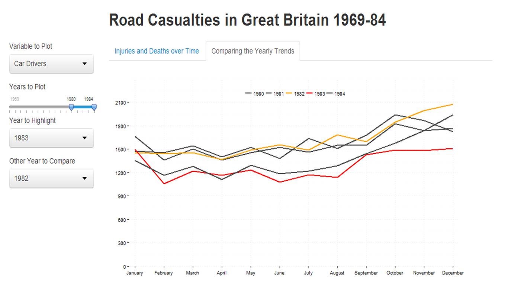

Homework 5: Time Series Visualization
==============================

| **Name**  | Cole Wrightson  |
|----------:|:-------------|
| **Email** | cwrightson@dons.usfca.edu |

## Instructions ##

The following packages must be installed prior to running this code:

- `ggplot2`
- `shiny`
- `GGally`
- `reshape`
- `scales`
- `plyr`

To run this code, please enter the following commands in R:

```
library(shiny)
shiny::runGitHub('msan622', 'cwrightson', subdir = "homework5")
```

This will start the `shiny` app. See below for details on how to interact with the visualization.

## Discussion ##

The UK Road Casualities data set contains monthly data on deaths and injuries that occurred on UK highways during the years 1969-1984 in addition to a few other statistics about travelling in the UK.
I choose to focus on the deaths and serious injuries that occurred each month as well as the location of the killed/injured within the car. 
  
My shiny application attempts to see how these injuries trend over time, investigate the cyclicale nature of highway death countries and compare the number of injures based on the person's location within the vehicle. 

My application has two interactive plots that are delimited by tabs.
The first tab, "Injuries and Deaths over Time", shows a multi-line plot.

![Plot1](Plot1.png

The plot initially dislays the five columns of data that are used in the visualization and compares their relative levels over time by plotting them all on the same x/y axis. The user is able to subset the data to plot the columns of data that they are most interested in.  The plot initially shows the entire 16 years for which there data set spans, however, the user can select any of the months as the starting or ending point in the plot. This changes the scale of the x-axis, but the user is able to know where the plot is relative to teh whole time series by the small overview plot that is just below the main visual.  Other customization that I did for this visual included, moving the legend and ensuring that the colors of each data time series were consistent no matter when subset of them were chosen to be plotted. I also automatically scale the x and y axes to the size of the data to be plotted and reformat the tick break points accordingly. 

The lie factor for this plot is one or very near one. There is no distortion of the data and I have ensured that the zero-intercept is always plotted. The data-ink ratio relatively high as the gridlines and annotations are minimal for conveying the information.  The legend is small and out of the way and the axis labels removed.  The data-ink ratio is not too high as the plot in general has fairly loq data density.  Data density is the quality that is most controlled by the user as they decide how much time to plot at once as well as how many series to plot at once.  Plotting more time and more time series increases the data density and therefore the data-ink ratio.  The overview plot underneath is useful for communicating the relative location of the time period plotted, but is does add an amount of redundancy to the visual and reduces a little the data-ink ratio.

The second tab. "Comparing the Yearly Trends", does not focus on the general time series trends or allow for comparison between whose was injured in the highway accidents. This graphic is about study the yearly changes in a given time series and compare the cyclical trends.




