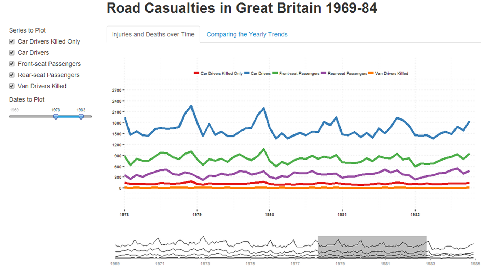

Homework 5: Time Series Visualization
==============================

| **Name**  | Cole Wrightson  |
|----------:|:-------------|
| **Email** | cwrightson@dons.usfca.edu |

## Instructions ##

The following packages must be installed prior to running this code:

- `ggplot2`
- `shiny`
- `GGally`
- `reshape`
- `scales`
- `plyr`

To run this code, please enter the following commands in R:

```
library(shiny)
shiny::runGitHub('msan622', 'cwrightson', subdir = "homework5")
```

This will start the `shiny` app. See below for details on how to interact with the visualization.

## Discussion ##

The UK Road Casualities data set contains monthly data on deaths and injuries that occurred on UK highways during the years 1969-1984 in addition to a few other statistics about travelling in the UK.
I choose to focus on the deaths and serious injuries that occurred each month as well as the location of the killed/injured within the car. 
  
My shiny application attempts to see how these injuries trend over time, investigate the cyclicale nature of highway death countries and compare the number of injures based on the person's location within the vehicle. 





