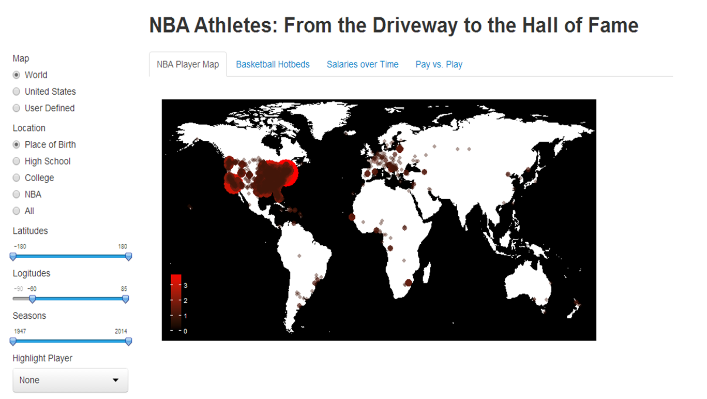

Project: Prototype
==============================

| **Name**  | Cole Wrightson |
|----------:|:-------------|
| **Email** | cwrightson@dons.usfca.edu |

## Discussion ##

My data set includes all of the places of birth, high schools and colleges (when known) pretaining to all 4000+ people to ever play a game in the NBA since its creation as the BAA in 1947. I created this dataset as a subset of the data that I scrapped from basketball-reference.com.  

The prototype shows the first interactive visualization that will be part of my app.  It is map that shows the cities of birth for all of the players on either a world or US map. The map can be changed to show either place of birth, high school or college attended before the NBA. The color and size of the dot are determined by the number of players that "belong" to that city.  

Additional interactivty to be added but shown in the interaction panel includes: highlighting players or cities, subsetting the players shown by season or show current players only, and connecting the locations that pretain to a particular player so as to show "basketball migrations."

