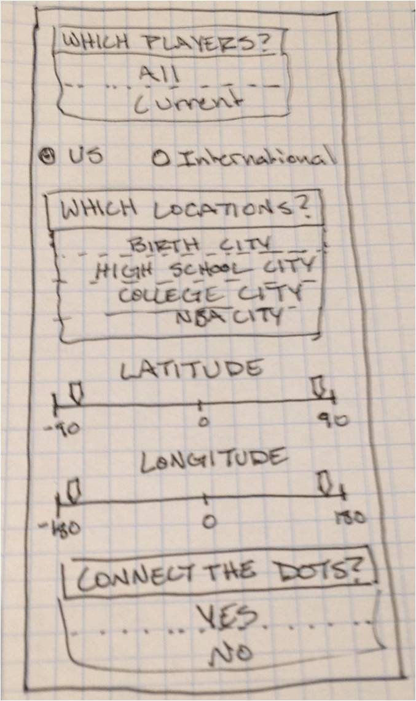
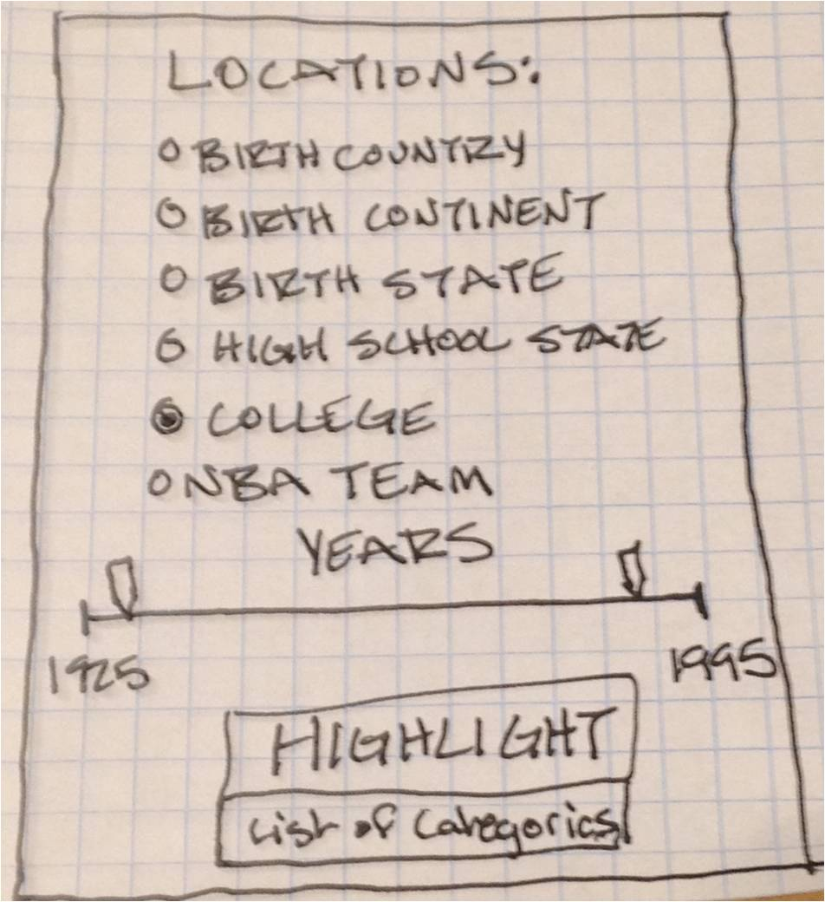
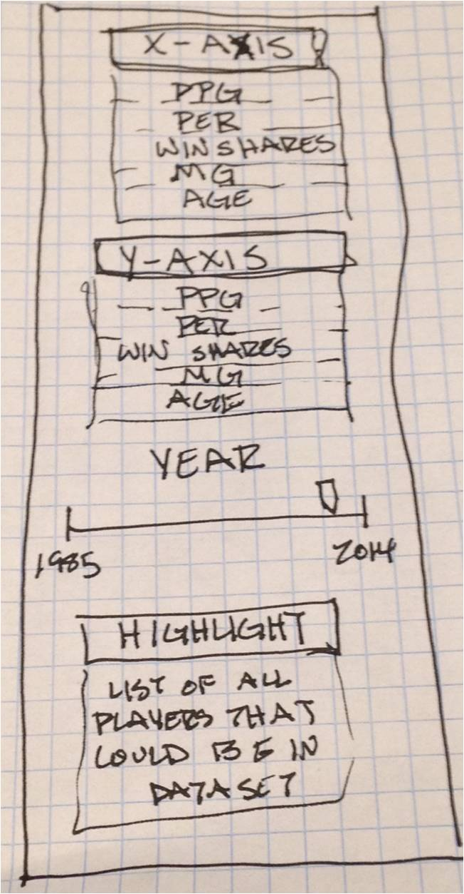
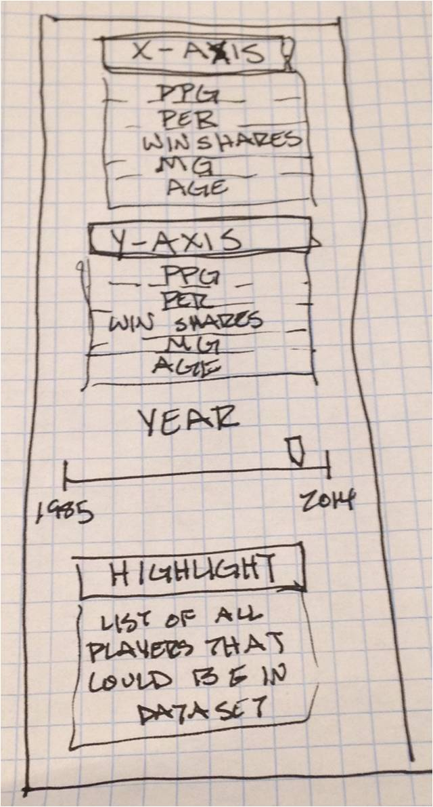

Project: Sketch
==============================

| **Name**  | Cole Wrightson  |
|----------:|:-------------|
| **Email** | cwrightson@dons.usfca.edu |

## Discussion ##

Overview:  

My shiny app will feature four plots focusing on two aspects, location and money, of the NBA players and how the change over time.  
Each plot will be under a separate tab and have its own interactivity panel.  
The first two plots focus of how player's birthplace and place of residence change over time as well as the general trends of the population of NBA players from the year 1955 until today.  
The second two plots will focus on how player salaries have evolved for both the individual and the top players in the league since the year 1985. 

Map of NBA Player Locations:  
  
I have data for some 4000 players that for the most part contains their city of birth, the city in which they attended high school, the college they attended, and the NBA teams that they played for.  
The shiny app will plot all of these locations on a map of the world or the US (the user decides) using dots that are sized by the number of players that are from that location.  
The map should have sliders that allow the user to pan and zoom around the map.  The user can also select what to plot, the player's birth city, high school city, college and professional team would all be options.  
The user will also be able to toggle on or off the lines that connect the dots of a single player's trajectory over their lifetime from birth to high school to college to the pros.  
Additionally the user can subset the data so as to plot all NBA players or only current NBA players. 
If this plot were to be animated, it would begin around the year 1920 and plot each time a player is born during the next 75 years until the entire world is covered in the player's birthplaces.

Stacked Area Plot of Location Influence on the NBA:  
  
In order to look at the same data from another point of view, I plan to create an interactive stacked area plot also dealing with NBA player location data.  
For this plot the x-axis will always be time and the y-axis the percentage of the total active NBA population that falls into the categories represented by the area.   
The categories the user can select from would include: Country of birth, Continent of birth, State of Birth, High School city, College, NBA team. 
The user should also be able to filter the years that they want to look at and highlight/brush the category that they are most interested in.
Because the number of categories would be too large to plot all of them at once, the most common or most influential handful would be plotted.

Streamgraph of Top Player Salaries in the NBA over the Years:  
  
I have found others that have written code to create streamgraphs in R and ggplot2 and would like to give it a try as I believe that top player salaries over time can be effectively visualized this way.  Unfortunately only the most recent 29 years of data is available but meaningful trends can still be found. 
The players that should be included in the graph are to be selected by the user from the following categories: Top 30 highest salaries, Top 30 point per game scorer, the 24 All-Stars, Top 30 Player Efficiency Rating.  A player that falls into any of these categories for a single season will have their entire career salary plotted.  
The user will be able to select the years to plot from a slider.  
The players will be indentified with text on the graph and not a legend.
  
Bubbleplot of Player Salaries related to Player Quality:  
  
Another way to look at player salaries over time is to animate a bubbleplot.  
In this plot the each dot will be a single player and the size of the dot will be determined by a player's salary for that year. 
The x and y axes will be user defined and focus of player quality.  These categories should include: Points per Game, Player Efficiency Rating, Win Shares per 48 Minutes, Minutes per Game, Age.  
The players to plot are determined by the user from the same four categories listed in the streamgraph.  
Animating the plot to show how player salary and performance change over the years would be the best.  However a similar effect could be achieved by connecting the dots that are plotted for a single player for all of his years in the league.
The user will also be able to highlight/brush any of the players plotted.

Drawings of Interactive Side Panels:

Map of NBA Player Locations:

Stacked Area Plot of Location Influence on the NBA:  

Streamgraph of Top Player Salaries in the NBA over the Years: 

Bubbleplot of Player Salaries related to Player Quality:

